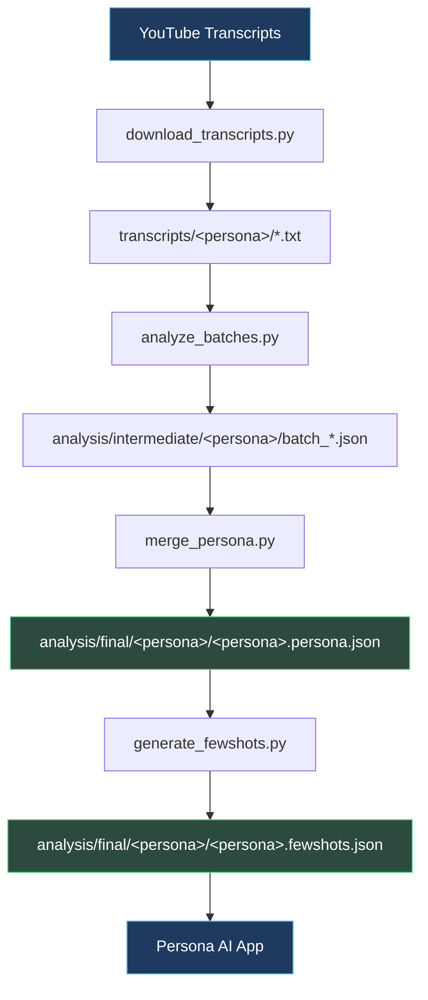
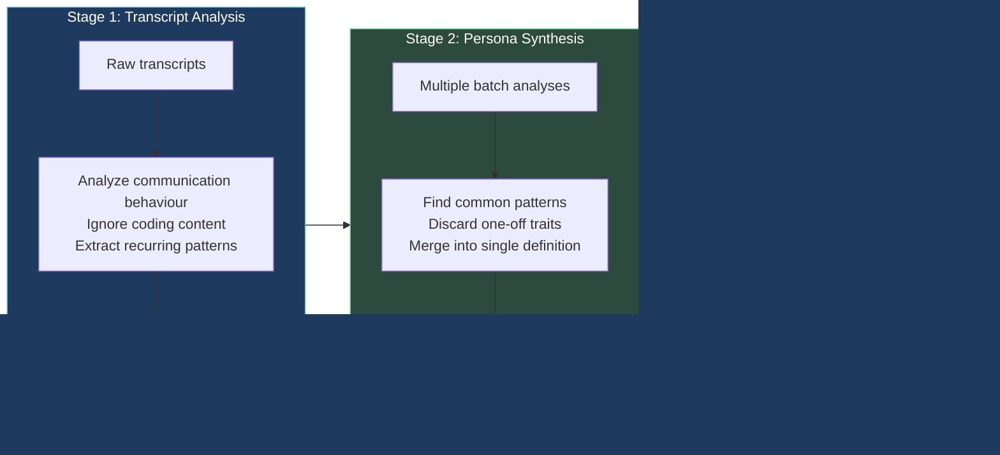
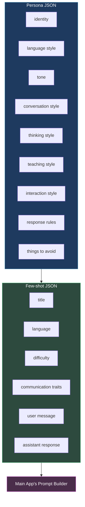

# Transcript Generator

This folder is the data preparation pipeline for **Persona AI**. Its purpose is to turn YouTube transcripts from a public educator into persona assets that the main app can use to simulate that educator's communication style in chat.

In short, the pipeline converts raw video transcripts into:

- a structured persona profile
- a set of few-shot examples for prompting
- JSON files that the app can load from the persona AI system

## What this pipeline is doing

The app does **not** learn from the transcripts at runtime. Instead, this pipeline acts as a preprocessing step that extracts behavioural patterns from transcript data and turns them into reusable prompt assets.

The end goal is to make the AI sound more like a specific educator by teaching it:

- how that person explains ideas
- how they structure responses
- how they handle misconceptions
- how they adapt to different student levels
- how they mentor in a conversational way

## Why this exists

The main Persona AI app needs a personality layer for each persona. That personality layer is built from:

- a persona definition JSON
- few-shot conversation examples
- prompt instructions that guide response style

This folder generates those assets from real transcript material.

## Pipeline overview



## Folder structure

```text
transcript-generator/
  requirements.txt
  scripts/
    analyze_batches.py
    download_transcripts.py
    generate_fewshots.py
    merge_persona.py
    prompts.py
    video_ids.py
  transcripts/
    hitesh/
    piyush/
  analysis/
    intermediate/
    final/
```

## Scripts explained

### 1. `download_transcripts.py`

**Purpose:**
- fetches YouTube transcripts for a configured persona
- saves each transcript as a plain text file in `transcripts/<persona>/`

**What it uses:**
- `youtube-transcript-api`
- video ID lists from `video_ids.py`

**Typical use:**
- set `PERSONA` to `hitesh` or `piyush`
- run the script to collect raw transcript data

### 2. `analyze_batches.py`

**Purpose:**
- reads transcript files in batches
- sends them to Gemini for communication-style analysis
- extracts *how* the educator teaches rather than *what* they teach

**Important detail:**
The script intentionally ignores programming concepts and focuses on:
- teaching flow
- reasoning style
- explanation patterns
- tone and mentoring behavior

**Output:** one JSON file per batch in `analysis/intermediate/<persona>/`

### 3. `merge_persona.py`

**Purpose:**
- combines all intermediate batch analyses into one unified persona profile
- performs a synthesis step so the final persona reflects consistent patterns across multiple videos

This is the step where the model acts like a "persona synthesizer" rather than a simple summarizer.

**Output:** `analysis/final/<persona>/<persona>.persona.json`

### 4. `generate_fewshots.py`

**Purpose:**
- reads the final persona profile
- generates realistic example conversations that teach the LLM how this educator mentors students

This produces few-shot examples that later get injected into the app's prompt context.

**Output:** `analysis/final/<persona>/<persona>.fewshots.json`

### 5. `prompts.py`

This file contains the system prompts used by the LLM during each stage.

| Prompt | Used for | Focus |
|---|---|---|
| `BATCH_ANALYSIS_PROMPT` | Analyzing a batch of transcripts | Communication behavior and teaching style |
| `MERGE_PERSONA_PROMPT` | Merging analyses into one persona spec | Consensus and long-term behavioural patterns |
| `FEW_SHOTS_PROMPT` | Generating example conversations | Demonstrating the persona's mentoring style |

These prompts are the heart of the pipeline because they define what the model should extract and how it should describe the persona.

## How the prompting works

The pipeline uses LLM prompting in three stages.



### Stage 1: Transcript analysis

The model is instructed to:

- analyze communication behaviour
- ignore the actual coding content
- extract recurring teaching patterns
- avoid surface-level traits like greetings or catchphrases
- return valid JSON

This stage is about turning raw transcripts into a behavioural specification.

### Stage 2: Persona synthesis

The model is given multiple independent analyses from different transcript batches and asked to:

- find common patterns
- discard one-off traits
- merge them into a single long-term persona definition
- produce structured JSON that can be reused by another LLM

This stage is more about consensus and stability than simple summarization.

### Stage 3: Few-shot generation

The model is given the final persona and asked to generate realistic conversations that show how the educator would respond in chat.

The few-shot examples are designed to teach the model:

- how to explain ideas clearly
- how to mentor without sounding robotic
- how to adapt to the student's language level
- how to stay conversational and practical

## What gets generated



### Persona JSON

The final persona JSON contains structured information such as:

- identity
- language style
- tone
- conversation style
- thinking style
- teaching style
- interaction style
- response-generation rules
- things to avoid

### Few-shot JSON

The few-shot JSON contains examples like:

- title
- language
- difficulty
- communication traits
- user message
- assistant response

These are later used by the main app's prompt builder to shape the assistant's behavior.

## Environment variables

The scripts expect a local environment file with API keys.

```env
GEMINI_API_KEY=your_gemini_key
GROQ_API_KEY=your_groq_key
```

You may also want to load a `.env` file from the `transcript-generator` directory depending on how you run the scripts.

## Installation

From the `transcript-generator` folder:

```bash
pip install -r requirements.txt
```

## Typical workflow

1. Place or update the video ID lists in `scripts/video_ids.py`
2. Run the downloader
3. Run the batch analyzer
4. Run the persona merger
5. Run the few-shot generator


Example:

```bash
python scripts/download_transcripts.py
python scripts/analyze_batches.py
python scripts/merge_persona.py
python scripts/generate_fewshots.py
```

## Notes

- The pipeline is intentionally opinionated: it is not trying to copy exact wording from transcripts.
- It is designed to extract behavioural patterns and turn them into reusable prompt instructions.
- The output JSON files are meant to support the main Persona AI app, not to serve as a standalone dataset by themselves.

## Example end-to-end flow

If you want a concrete mental model, think of it like this:

1. You collect a bunch of videos from one educator.
2. You ask the model to infer how that educator teaches.
3. You merge those observations into a stable persona spec.
4. You generate example conversations that illustrate that style.
5. The main app uses those files to make the assistant behave more like that educator.

## In one sentence

This folder turns transcript data into a reusable "teaching persona" that helps the main chat app respond more like a specific educator.